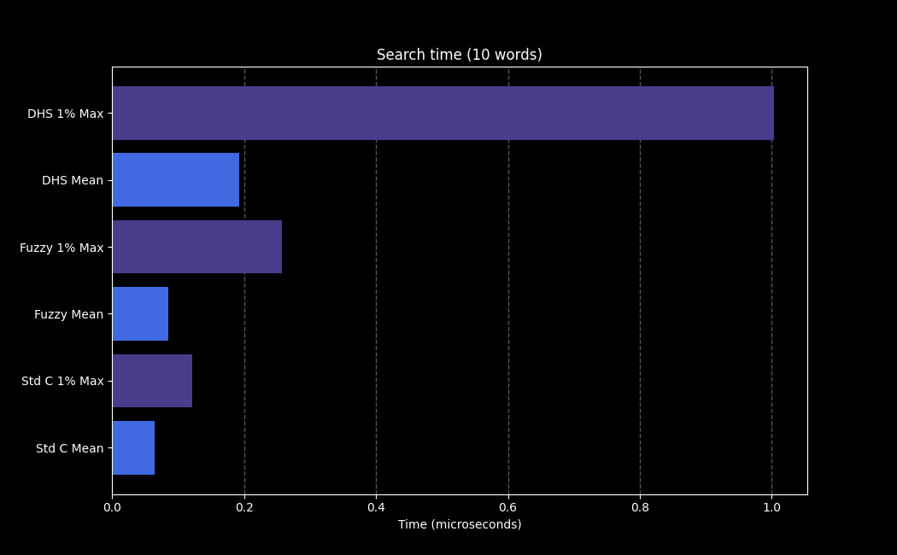
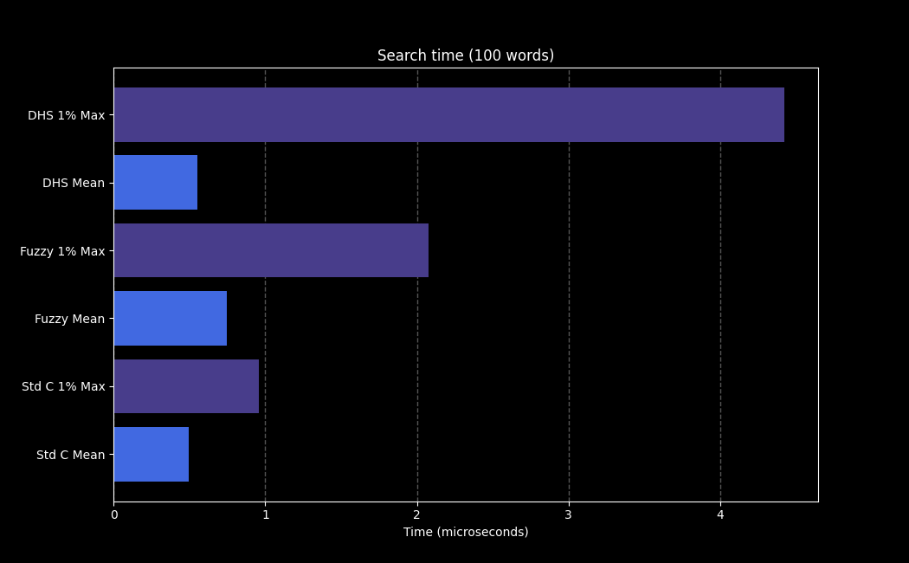
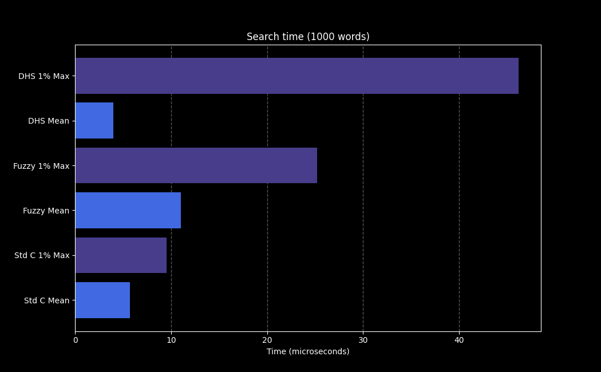
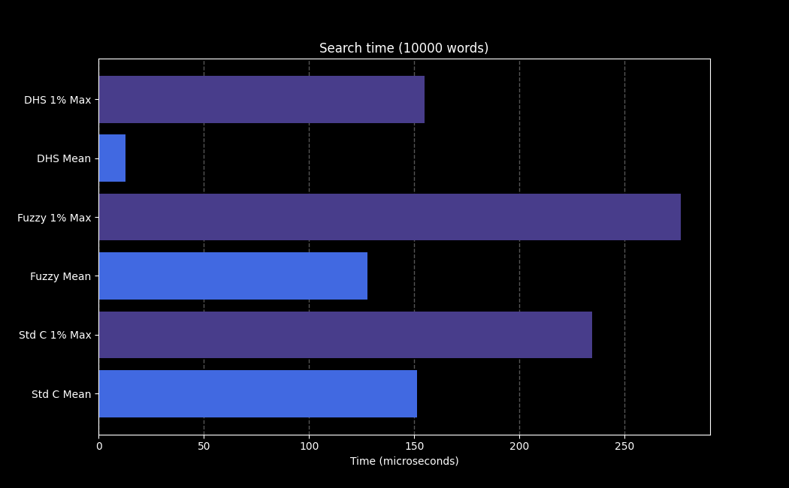

# Dynamic Double Hash Search

## Memory Usage

- 10.000 words = 7 Mb of memory
- 100.000 words = 100 Mb of memory

## Search time

- If not found < 1 microsecond
- If found around 20 microsecond

## Graphs for comparison

